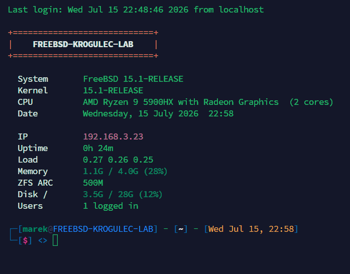

# homelab-bootstrap

Modular, idempotent setup script for RHEL / Fedora / Debian / Ubuntu / FreeBSD / Solaris servers.



```bash
bash <(curl -fsSL https://raw.githubusercontent.com/Quaerendir/homelab-bootstrap/main/install.sh)
```

Or clone and run:

```bash
git clone https://github.com/Quaerendir/homelab-bootstrap.git
cd homelab-bootstrap
./install.sh
```

No arguments = interactive menu. Pick modules per host.

> **FreeBSD:** base install has no bash/curl/sudo/git — bootstrap those first as root:
> `pkg install -y bash curl git sudo`

> **Solaris 11.4:** minimal images may lack bash/curl/sudo/git — bootstrap those first as root:
> `pkg install shell/bash web/curl developer/versioning/git security/sudo`

---

## Modules

| Flag | What it does |
|------|-------------|
| `--motd` | Dynamic MOTD, distro-aware: `profile.d` (RHEL), `update-motd.d`+PAM (Debian/Ubuntu), login-shell hook (FreeBSD, Solaris). Silences RH Insights prompt. |
| `--zsh` | zsh + Oh My Zsh + plugins (autosuggestions, syntax-highlighting, history-substring-search) + `.zshrc` |
| `--pay-respects` | [pay-respects](https://github.com/iffse/pay-respects) — Rust `thefuck` replacement, single static binary, no Python runtime. Distro pkg → cargo → prebuilt binary. Press `f`. (`--thefuck` kept as a deprecated alias.) |
| `--ssh` | sshd hardening drop-in — no root, no passwords, keepalive. Validates before restart. |
| `--sudo` | sudoers drop-in — wheel with password. Removes cloud-init NOPASSWD. Validates before deploy. |
| `--all` | All modules in sequence |

## Examples

```bash
./install.sh                  # interactive menu
./install.sh --all            # everything
./install.sh --zsh --motd     # new VM, comfort only
./install.sh --ssh --sudo     # production hardening only
```

## One-liner per module

```bash
# Just MOTD
bash <(curl -fsSL https://raw.githubusercontent.com/Quaerendir/homelab-bootstrap/main/install.sh) --motd

# Just zsh
bash <(curl -fsSL https://raw.githubusercontent.com/Quaerendir/homelab-bootstrap/main/install.sh) --zsh
```

## Structure

```
homelab-bootstrap/
├── install.sh                      # Main installer
├── README.md
├── LICENSE                         # MIT
├── CHANGELOG.md
├── CONTRIBUTING.md
├── SECURITY.md
├── .gitignore
├── images/
│   └── motd-preview.png             # README preview
├── motd/
│   ├── motd.sh                      # RHEL/Fedora -> /etc/profile.d/motd.sh
│   ├── motd-debian.sh                # Debian/Ubuntu -> /etc/update-motd.d/01-homelab
│   ├── motd-freebsd.sh               # FreeBSD -> /usr/local/etc/homelab-motd.sh
│   └── motd-solaris.sh               # Solaris -> /etc/homelab-motd.sh
├── zsh/
│   └── zshrc                       # .zshrc (OMZ + plugins + history + aliases)
├── ssh/
│   └── sshd_hardening.conf         # sshd drop-in
└── sudo/
    └── 10-wheel-hardening          # sudoers drop-in
```

## Compatibility

| Distro | Tested |
|--------|--------|
| RHEL 9 / 10 | yes |
| Fedora 39+ | yes |
| Debian 12 | yes |
| Ubuntu 22.04 / 24.04 | yes |
| FreeBSD 13.0+ | yes |
| Solaris 11.4 | yes (all 4 modules verified live via SSH, 2026-09-10) |

## Safety

- `.zshrc` backed up before overwriting
- `--ssh` runs `sshd -t` validation before restart
- `--sudo` runs `visudo -cf` before deployment
- All modules are idempotent — safe to re-run
- FreeBSD: `--ssh` backs up `sshd_config` before prepending the `Include` directive (base config ships without one); `--motd` disables the stock MOTD via `sysrc update_motd=NO` and only hooks `sh`/`bash`/`zsh` login shells — csh/tcsh won't source it
- Solaris: `--ssh` backs up `sshd_config` before prepending `Include` (SMF-restarted via `svcadm`, validated with the full `/usr/lib/ssh/sshd` path since it isn't on `$PATH`); `--motd` truncates `/etc/motd` (sshd's `PrintMotd` reads it directly) and only hooks `sh`/`ksh`/`bash`/`zsh` login shells; `--sudo` needs a `wheel` group to exist (Solaris has none by default) and warns if `/etc/sudoers` has no `includedir`; `--zsh` sets the login shell via `usermod` (no `chsh` on Solaris). All four modules were run twice in a row against a live Solaris 11.4 box to confirm idempotency (no duplicate hooks/Include lines/backups on the second run). Native `/usr/bin/grep` on Solaris is a pre-XPG4 SVR4 grep with **no `-F`, no `-E`, no `[[:space:]]`** — every Solaris-branch `grep` call in `install.sh` avoids these deliberately; don't "clean up" them to match the GNU/BSD-grep style used elsewhere in the file. IPS package names in `pkg_install()` are best-effort — verify against your publisher.
- **Solaris SSH client gotcha (unrelated to this script, but hits every login):** if your SSH client forwards `LANG`/`LC_*` (common OpenSSH default, `SendEnv LANG LC_*` in `/etc/ssh/ssh_config` or `~/.ssh/config`) and your locale isn't one of the handful Oracle ships for Solaris 11.4 x86 (`locale -a`: only `de_DE`, `en_US`, `es_ES`, `fr_FR`, `it_IT`, `ja_JP`, `ko_KR`, `pt_BR`, `zh_CN`, `zh_TW` — no `pl_PL`, no `en_GB`, and there's no installable package for the missing ones from the `solaris` publisher), every perl-based tool invoked at login (the stock `/etc/profile`'s mail check, `kstat` used by `motd-solaris.sh`, etc.) prints a `perl: warning: Setting locale failed` block on every connection. A plain `SendEnv -LANG -LC_*` override in `~/.ssh/config` **does not fix this** — it loses to a broader `SendEnv LANG LC_*` in `/etc/ssh/ssh_config` because SendEnv patterns accumulate across config files rather than "first match wins". What does work: `SetEnv LANG=en_US.UTF-8 LC_ADDRESS=en_US.UTF-8 ...` (one `SetEnv` per forwarded `LC_*` name, pinned to an installed locale) in the client's `Host` block for that box.
- **Read [SECURITY.md](SECURITY.md) before running `--ssh` or `--sudo` on production**

## License

MIT — see [LICENSE](LICENSE)
